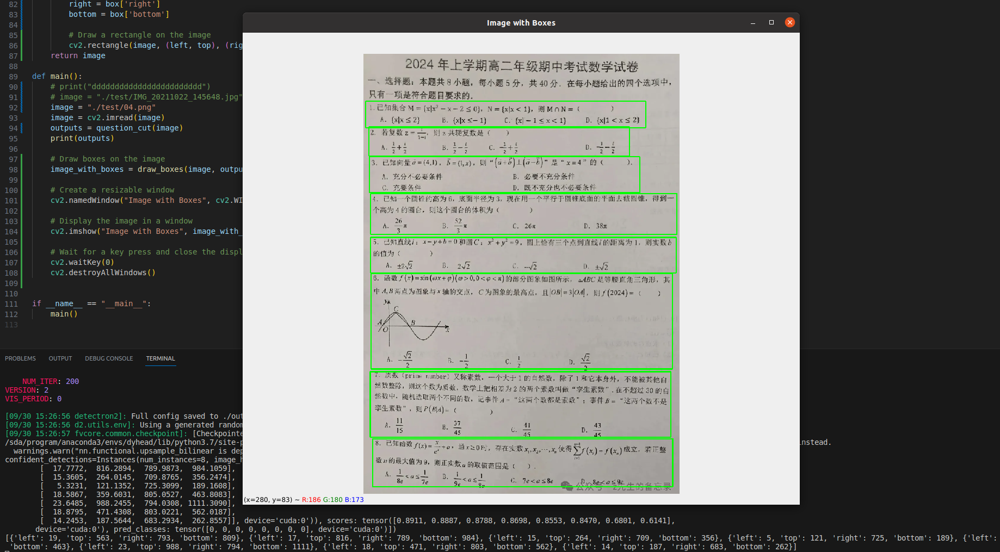
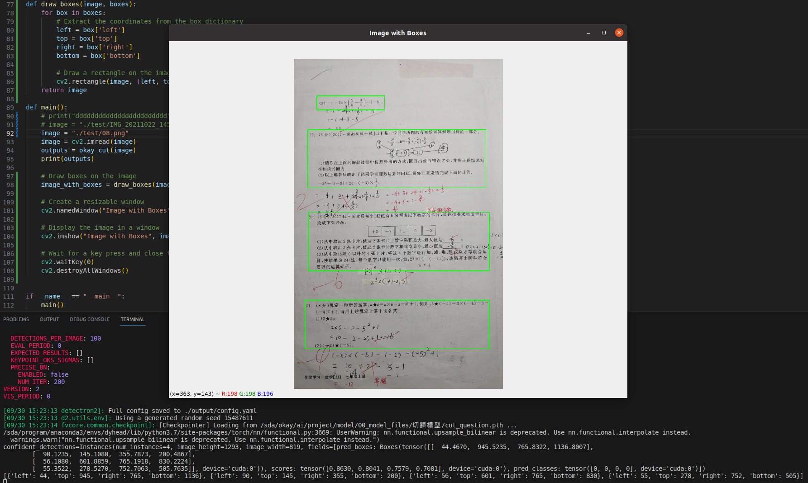

<div align="center">   

# Dynamic Head: Unifying Object Detection Heads with Attentions
</div>

Reference: https://github.com/microsoft/DynamicHead

### Model Zoo
| Config                                                                       |           Model         |   Backbone  | Scheduler | COCO mAP |  Weight                                                                                |       
|------------------------------------------------------------------------------|-------------------------|-------------|-----------|----------|----------------------------------------------------------------------------------------|                                                                                                                                                 
|  [cfg](configs/dyhead_swint_atss_fpn_2x_ms.yaml)                             |    ATSS + DyHead        |   Swin-Tiny | 2x + ms   | 49.8     |  [weight](cut_question.pth) |    


### Usage
**Dependencies:**

[Detectron2](https://detectron2.readthedocs.io/en/latest/tutorials/install.html), [timm](https://rwightman.github.io/pytorch-image-models/)

**Installation:**

```
pip install torch==1.7.1+cu101 torchvision==0.8.2+cu101 torchaudio==0.7.2 -f https://download.pytorch.org/whl/torch_stable.html
pip install -e .
pip install -e detectron2
```

**Train:**
```
python train_net.py --config="configs/dyhead_swint_atss_fpn_2x_ms.yaml"
```

**Test:**
```
python predictor.py
```

### Examples





### Citation

```BibTeX
@InProceedings{Dai_2021_CVPR,
    author    = {Dai, Xiyang and Chen, Yinpeng and Xiao, Bin and Chen, Dongdong and Liu, Mengchen and Yuan, Lu and Zhang, Lei},
    title     = {Dynamic Head: Unifying Object Detection Heads With Attentions},
    booktitle = {Proceedings of the IEEE/CVF Conference on Computer Vision and Pattern Recognition (CVPR)},
    month     = {June},
    year      = {2021},
    pages     = {7373-7382}
}
```


### Contributing

This project welcomes contributions and suggestions.  Most contributions require you to agree to a
Contributor License Agreement (CLA) declaring that you have the right to, and actually do, grant us
the rights to use your contribution. For details, visit https://cla.opensource.microsoft.com.

When you submit a pull request, a CLA bot will automatically determine whether you need to provide
a CLA and decorate the PR appropriately (e.g., status check, comment). Simply follow the instructions
provided by the bot. You will only need to do this once across all repos using our CLA.

This project has adopted the [Microsoft Open Source Code of Conduct](https://opensource.microsoft.com/codeofconduct/).
For more information see the [Code of Conduct FAQ](https://opensource.microsoft.com/codeofconduct/faq/) or
contact [opencode@microsoft.com](mailto:opencode@microsoft.com) with any additional questions or comments.

